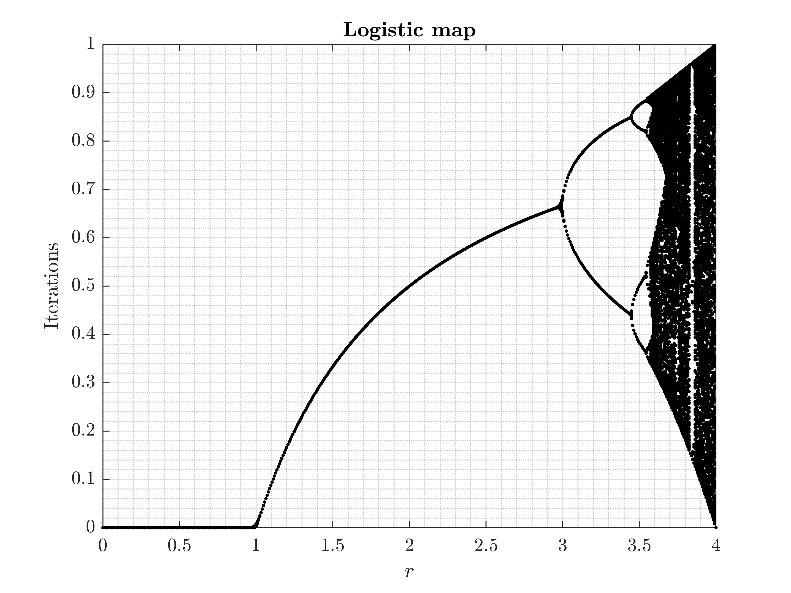

# Nonlinear System Dynamics

Nonlinear Dynamics Systems

## 1-Dimensional Systems

### Logistic Map

### Euler Method

### Fixed Points Stability

### Pitchfork Bifurcation

### Neuron Model

### Laser

### Adler equation

### Delayed Logistic equation

### Stability Test

## 2-Dimensional Systems

## 2D System Phase Portrait

## Direction Field

## Chaotic Systems - Lorenz System
Let us consider the Lorenz system:
$$
\begin{array}{r}
\dot{x}=\sigma(y-x) \\
\dot{y}=\rho x-y-x z \\
\dot{z}=-\beta z+x y
\end{array}
$$

## Maximum Lyapunov Exponent

## Henon Map

## Rossler System

